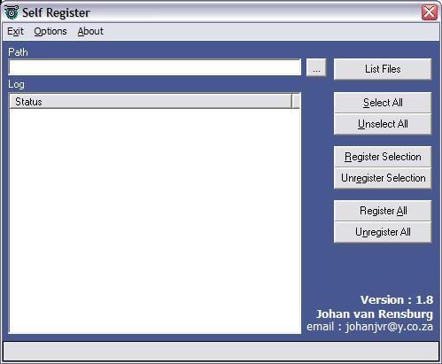

<div align="center">

## Self Register


</div>

### Description

Register or UnRegister all your com server's (OCX / Dll) in the same directory. Without regsvr32.exe
 
### More Info
 
Nothing :)


<span>             |<span>
---                |---
**Submitted On**   |2003-09-27 16:00:28
**By**             |[Nuz](https://github.com/Planet-Source-Code/PSCIndex/blob/master/ByAuthor/nuz.md)
**Level**          |Advanced
**User Rating**    |5.0 (15 globes from 3 users)
**Compatibility**  |VB 5\.0, VB 6\.0
**Category**       |[Complete Applications](https://github.com/Planet-Source-Code/PSCIndex/blob/master/ByCategory/complete-applications__1-27.md)
**World**          |[Visual Basic](https://github.com/Planet-Source-Code/PSCIndex/blob/master/ByWorld/visual-basic.md)
**Archive File**   |[Nuz1650649272003\.zip](https://github.com/Planet-Source-Code/nuz-self-register__1-48813/archive/master.zip)

### API Declarations

```
Declare Function FreeLibrary Lib "kernel32" (ByVal hLibModule As Long) As Long
Declare Function LoadLibrary Lib "kernel32" Alias "LoadLibraryA" (ByVal lpLibFileName As String) As Long
Declare Function GetProcAddress Lib "kernel32" (ByVal hModule As Long, ByVal lpProcName As String) As Long
Declare Function CallWindowProc Lib "user32" Alias "CallWindowProcA" (ByVal lpPrevWndFunc As Long, ByVal hWnd As Long, ByVal Msg As Any, ByVal wParam As Any, ByVal lParam As Any) As Long
```


